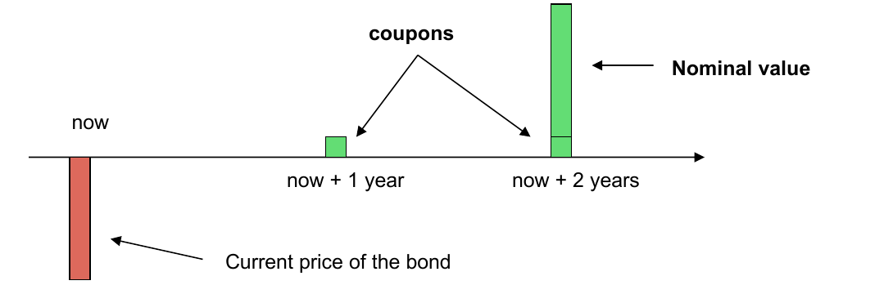
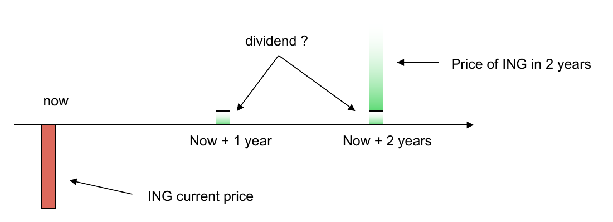
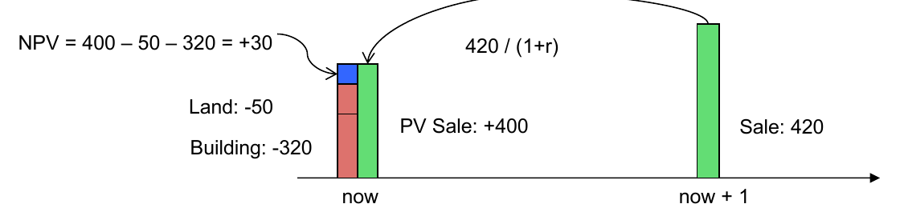
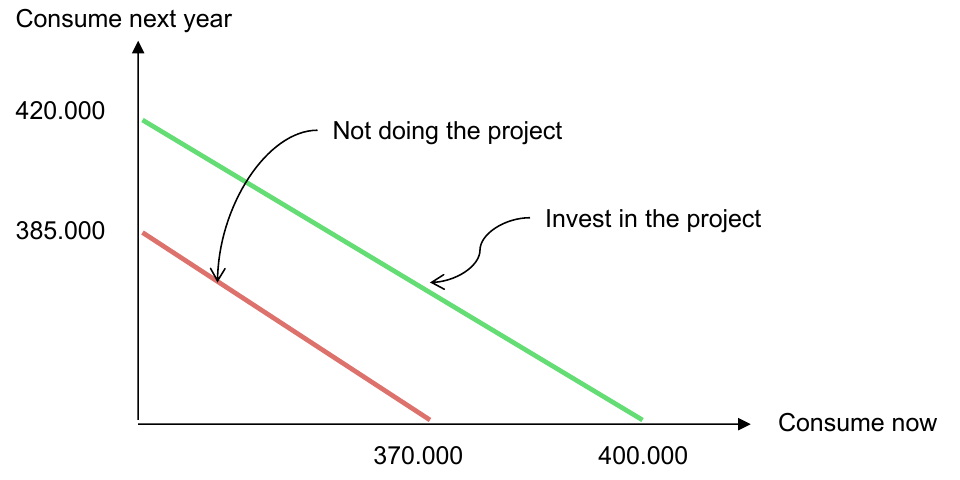
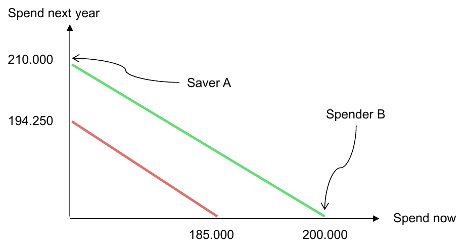
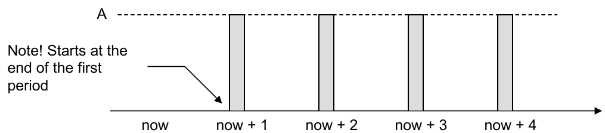
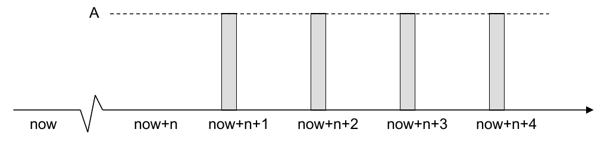
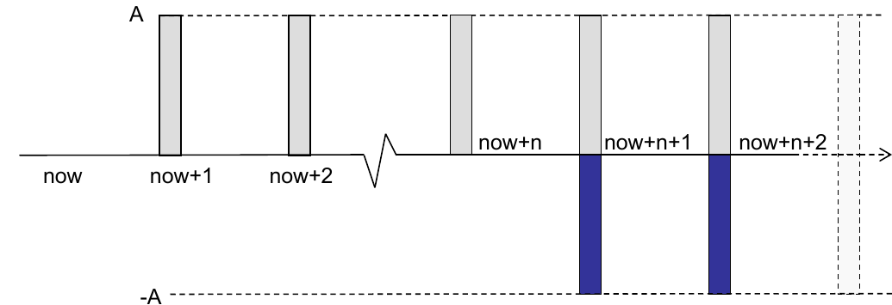
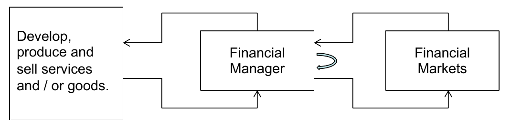

# Principles of Asset Trading — Lecture 1

**Topics:** cash-flow streams → PV / FV / NPV → opportunity cost of capital → why the NPV rule works → perpetuities, annuities, amortization

---

## Summary

Every investment is a **cash-flow stream**. Investing means trading assets so that the resulting stream best matches the investor's preferences. To compare cash flows at different dates, you move them to the same point in time by **discounting**. The discount rate is the **opportunity cost of capital**: the expected return the market offers on an investment with the **same risk**. A project creates value when **NPV > 0**, which is equivalent to its **rate of return > opportunity cost of capital**. The NPV rule is right for every shareholder, saver or spender alike, **provided capital markets are efficient**. Recurring cash flows are valued with closed-form formulas: perpetuity, delayed perpetuity, annuity and amortization.

---

## 1. Cash-flow streams

Cash flows at several points in time form a **cash-flow stream**.

| Asset                        | t = 0          | t = 1      | t = 2                                   |
| ---------------------------- | -------------- | ---------- | --------------------------------------- |
| 2-year government bond       | −price         | +coupon    | +coupon + nominal                       |
| Buy and hold ING for 2 years | −current price | +dividend? | +dividend? + price in 2 yrs (uncertain) |





**Types of cash flow:**

- **Deterministic:** the amount is known in advance (bond coupons).
- **Stochastic:** a random amount at a possibly random time. That uncertainty is **risk**.

> **Investing** = trading assets so that the resulting cash flows best match the investor's preferences. To do this, you must know how each asset type behaves.

---

## 2. Present value and NPV

### 2.1 Intuition

**A euro now is worth more than a euro in a year**, because you can put today's euro in the bank and earn interest.

### 2.2 Definitions

- **Present value (PV):** the amount you need to put in the bank _now_ so that, at the appropriate rate, it grows to the future cash flow.
- **Future value (FV):** what a cash amount now grows to at that rate.

$$PV = \frac{C_1}{1+r} \qquad FV = C_0 \cdot (1+r)$$

- **NPV** = PV of the future cash flows − the initial investment.
- **Additivity rule:** you may only add or subtract cash flows after moving them to the **same point in time**.

### 2.3 Worked example: office building

Land costs €50,000 now and the building €320,000 now. You are _sure_ to sell it in 1 year for €420,000.

**(a) Risk-free, discounted at r = 5% (government bond):**

$$PV = \frac{420{,}000}{1.05} = 400{,}000 \qquad NPV = 400{,}000 - 50{,}000 - 320{,}000 = +30{,}000$$



**(b) Same risk as stocks, discounted at r = 12%:**

$$PV = \frac{420{,}000}{1.12} = 375{,}000 \qquad NPV = 375{,}000 - 370{,}000 = +5{,}000$$

- A **higher discount rate gives a lower PV.** You pay less now for a _risky_ euro, which is the same as demanding a higher return.
- The gap 420 → 375 splits into two parts:
  - **time value of money:** 420 → 400, i.e. €20k
  - **risk:** 400 → 375, i.e. €25k

> **Rule:** discount uncertain cash flows at the average return of investments with the **same risk**, not at the risk-free rate.

---

## 3. Opportunity cost of capital

### 3.1 Definition

The **opportunity cost of capital** is the average return the market offers on an investment with the **same risk profile**. It's what you give up by investing in the project instead. It sounds simple, but finding the "same" risk profile is hard.

### 3.2 Rate of return (one period)

$$ROR = \frac{\text{Revenue} - \text{Investment}}{\text{Investment}} = \frac{420 - 370}{370} = 13.5\%$$

### 3.3 Two equivalent decision rules

1. **NPV rule:** accept if NPV > 0.
2. **Rate-of-return rule:** accept if ROR > opportunity cost of capital.

- Check with the office building: 13.5% > 12%, which matches NPV = +5k > 0.
- The rate of return is also called the **internal rate of return (IRR)** and is expressed as an **annual** rate.

### 3.4 Worked example: three scenarios

You invest €100 today. Next year the payoff is 80, 110 or 140, each with probability ⅓.

$$E[\text{payoff}] = \tfrac{1}{3} \cdot (80 + 110 + 140) = 110$$

A stock with **exactly the same outcomes** trades at €95.65.

|         | Price today | Expected payoff | Expected return          |
| ------- | ----------- | --------------- | ------------------------ |
| Stock X | 95.65       | 110             | $110 / 95.65 - 1 = 15\%$ |
| Project | 100         | 110             | $110 / 100 - 1 = 10\%$   |

- The opportunity cost of capital is **15%**, because the stock has identical risk.
- The project returns 10% < 15%, so **reject** it.

$$NPV = \frac{110}{1.15} - 100 = 95.65 - 100 = -4.35$$

- Intuition: you can buy the same risky payoff for €95.65 in the market, so paying €100 for it destroys €4.35.

### 3.5 Exam trap: "but the bank lends at 8%"

Suppose the company can borrow at 8%. **The opportunity cost stays at 15%**: it depends on the _project's risk_, not on how you finance it.

- **Why not?** **[beyond slides, B&M reasoning]**
  - If you borrow €100 at 8%, the best use of it is still stock X, which offers 15% for the same risk.
  - Putting the money into the project instead forgoes that 15%, so the 15% is the cost.
- **Why does the bank lend at 8%?** **[beyond slides]**
  - The bank's loan is **safer** than the project. The firm must repay whatever the project's outcome, and the bank has a claim on all the firm's assets and a higher priority than shareholders.
  - The 8% therefore prices the _loan's_ lower risk, not the project's risk.
  - The shareholders carry the project risk and demand 15%.

---

## 4. Why is the NPV rule true?

Take the office building again: invest 370, receive 420 in 1 year, rate 5%. **Capital markets let you move cash through time** at the rate that fits the risk (lend or borrow at 5%). The two options give two consumption lines, each with slope −1.05:

|                     | Max consume now      | Max consume next year  |
| ------------------- | -------------------- | ---------------------- |
| Without the project | 370                  | 370 · 1.05 = **388.5** |
| With the project    | 420 / 1.05 = **400** | **420**                |

- ⚠️ The lecture labels the "not doing the project" intercept as **385**. The correct value is 370 · 1.05 = **388.5**.

  

- The "with project" line lies above the other one **everywhere**. The vertical gap at "now" is 400 − 370 = 30 = **NPV**.

### 4.1 Saver vs spender

Two investors each have €185k. That's half the project, so each gets 185/370 of the €420k payoff, i.e. €210k.

- **Saver A** wants the most money next year.
  - Invests in the project and ends up with **€210k**.
  - The bank alternative gives 185 · 1.05 = **€194.25k**.
- **Spender B** wants the most money now.
  - Puts €185k in the project, which pays €210k next year.
  - Borrows 210 / 1.05 = **€200k** today and spends it.
  - Next year, the €210k repays the loan: 200 · 1.05 = 210.
  - So B spends **€200k now** instead of 185.

B's gain of 200 − 185 = €15k is exactly B's share of the NPV: $30 \cdot \tfrac{185}{370} = 15$.



> Saver or spender, **every investor is better off with a positive-NPV project**. Managers don't need to know shareholders' time preferences. **This is only true if capital markets are efficient**, i.e. everyone can borrow and lend at the rate that fits the risk.

### 4.2 The goal of the company

- The board's goal is **creating shareholder value**. Managers should act in shareholders' interest by doing **NPV > 0 projects only**.
- **Why not maximise profit?** **[beyond slides]** Accounting profit ignores the **timing** and the **risk** of cash flows. NPV includes both.
- The lecture also opens the **shareholder vs stakeholder** debate. The alternative view says employees, society and the environment also count.

---

## 5. Valuation formulae

Notation: $A$ = cash flow per period, $r$ = rate per period, and the **first payment falls at the end of period 1** (not "now").

### 5.1 Perpetuity (infinite annuity)



Split off the first term. Everything from period 2 onward is again a perpetuity, just one period later:

$$P = \sum_{k=1}^{\infty} \frac{A}{(1+r)^k} = \frac{A}{1+r} + \sum_{k=2}^{\infty} \frac{A}{(1+r)^k} = \frac{A + P}{1+r} \;\Rightarrow\; \boxed{P = \frac{A}{r}}$$

_Example:_ €50 per year forever at 5% gives $P = 50 / 0.05 = €1{,}000$.

### 5.2 n-step delayed perpetuity



Payments run from $n+1$ onward. At time $n$ this is a normal perpetuity worth $P$, which you then discount $n$ periods back:

$$\boxed{P_{(n,\infty]} = \frac{P}{(1+r)^n} = \frac{A}{r \cdot (1+r)^n}}$$

### 5.3 Annuity (payments at 1 … n)



An annuity = a perpetuity **minus** a perpetuity delayed by $n$. The minus cancels every payment after $n$:

$$\boxed{P_{(0,n]} = P - P_{(n,\infty]} = \frac{A}{r}\left(1 - \frac{1}{(1+r)^n}\right)}$$

_Example:_ €1,000 per year for 5 years at 5%:

$$P_{(0,5]} = \frac{1000}{0.05} \cdot \left(1 - \frac{1}{1.05^5}\right) = 20{,}000 \cdot (1 - 0.7835) = €4{,}329.48$$

### 5.4 Amortization (the inverse)

Question: how much $A$ can you pay per period to pay off a loan $P_{(0,n]}$?

$$\boxed{A = \frac{r \cdot (1+r)^n}{(1+r)^n - 1} \cdot P_{(0,n]}}$$

**Worked example: mortgage.** A €250,000 loan at 5.4% for 30 years, repaid monthly.

1. Monthly rate: $r = 5.4\% / 12 = 0.0045$.
2. Number of payments: $n = 30 \cdot 12 = 360$.
3. Monthly payment:

$$A = \frac{0.0045 \cdot 1.0045^{360}}{1.0045^{360} - 1} \cdot 250{,}000 \approx €1{,}404 \text{ per month}$$

- **Month 1 split:** interest $= 0.0045 \cdot 250{,}000 = €1{,}125$, so only €278.83 goes to repaying the loan. Early payments are mostly interest.
- **Total paid** $= 1{,}403.83 \cdot 360 \approx €505{,}378$, about twice the loan.

> **Exam traps**
>
> - **Match $r$ and $n$ to the payment period.** Monthly payments need a monthly rate _and_ $n$ in months.
> - The lecture uses **nominal / 12**. If 5.4% were an _effective_ annual rate, the monthly rate would be $1.054^{1/12} - 1 = 0.439\%$ and $A \approx €1{,}384$. Nominal vs effective rates come in a later lecture.
> - All these formulas assume the **first payment one period from now**. If the first payment is today, add $A$ or multiply by $(1+r)$.

---

## Questions from the lecture

**Q1. Asset trading deals with various types of assets. Examples?**
**Answer:** Stocks, bonds, savings and term deposits, ETFs, derivatives (futures, options, swaps, turbos), plus real estate, commodities, currencies and crypto.
_Why:_ an asset is anything that carries value and produces a (possibly uncertain) cash-flow stream. That's the definition that makes it tradeable.

**Q2. The book is about corporate finance, the course about asset trading. What is the difference?**
**Answer:** Corporate finance is about how **corporations** finance their activities. Asset trading is **broader**: it covers the trading of value-carrying assets by **retail, institutional and corporate** investors in the market.
_Why:_ the same tools (PV, NPV, cost of capital) apply to anyone trading assets, not just to a firm's financial manager.

**Q3. In the corporation diagram (financial markets ⇄ financial manager ⇄ operations), the arrows are cash flows. What happens at each arrow?**
**Answer:**



1. Investors buy the firm's securities, and cash flows from the markets to the financial manager.
2. The manager invests that cash in operations (develop, produce, sell).
3. Operations generate cash, which flows back to the manager.
4. That cash is either (a) **reinvested** in the firm or (b) **returned** to investors as dividends or interest.

_Why:_ the financial manager is the link between the markets and the business. Every arrow is money moving, which is the cash-flow view of Lecture 1.

**Q4. Can you think of another instrument than shares?**
**Answer:** **Bonds / bank loans** (debt).
_Why:_ a firm can raise money by selling ownership (equity) or by borrowing (debt). With debt, investors get fixed coupons and their nominal back, not ownership.

**Q5. Who is the boss of the company, and how is this arranged?**
**Answer:** The **shareholders**. At the shareholder meeting they appoint the board, which appoints and oversees management.
_Why:_ shareholders own the company and carry the residual risk, so they have final decision power. This is also why the goal is shareholder value (§4.2).

**Q6. Is the office building a good investment, i.e. do you prefer €420k in one year over €370k now?**
**Answer:** Yes. NPV = +30k at 5% (risk-free) and still +5k at 12% (stock-like risk).
_Why:_ €420k in a year is worth €400k (or €375k if risky) today, which is more than the €370k it costs (§2.3).

**Q7. Discounting at 12% instead of 5%: will the PV of the €420k increase or decrease?**
**Answer:** Decrease, from 400 to 375.
_Why:_ you pay less today for a risky euro, which is the same as demanding a higher return (§2.3).

**Q8. The project (invest 100, payoff 80/110/140) vs a stock with the same outcomes at 95.65: which do you prefer and why?**
**Answer:** The stock.
_Why:_ it gives the identical risky payoff for 95.65 instead of 100. The project's expected return of 10% is below the 15% opportunity cost, so NPV = −4.35 (§3.4).

**Q9. The bank lends at 8%. Does that justify the project? Why not? Then why does the bank lend at 8%?**
**Answer:** No. The opportunity cost stays at 15%. The bank lends at 8% because its loan is **safer** than the project.
_Why:_ the cost of capital depends on the project's risk, not on the financing. Borrowed money could still earn 15% in stock X at the same risk. The loan has a claim on the whole firm and priority over shareholders, so it needs a lower return (§3.5).

**Q10. You want to consume part now and part later: what possibilities do you have?**
**Answer:** Any point on the line through (370 now, 388.5 next year) without the project, or (400 now, 420 next year) with it.
_Why:_ borrowing and lending at 5% lets you slide along a line with slope −1.05. The project shifts the whole line outward by the NPV (§4).

**Q11. Two investors with €185k each: saver A and spender B. What is their strategy?**
**Answer:** A invests in the project and has €210k next year (vs €194.25k at the bank). B invests in the project, borrows €200k against the €210k payoff and spends €200k now (vs €185k).
_Why:_ capital markets move cash through time, so a positive-NPV project helps both savers and spenders (§4.1).

**Q12. What should be the goal of the board? Why not increasing profit? Shareholders vs stakeholders?**
**Answer:** **Creating shareholder value**, by doing only NPV > 0 projects.
_Why:_

- Profit ignores the **timing** and **risk** of cash flows; NPV includes both.
- The stakeholder view adds employees, society and the environment. NPV-maximisation ignores those unless their effects are priced into the cash flows (§4.2).

---

## Key-formulas box

$$PV = \frac{C_t}{(1+r)^t} \qquad FV = C_0 \cdot (1+r)^t \qquad NPV = -C_0 + \sum_t \frac{C_t}{(1+r)^t}$$

$$ROR = \frac{\text{Revenue} - \text{Investment}}{\text{Investment}} \qquad \text{Accept if } NPV > 0 \iff ROR > r_{\text{opp}}$$

$$P = \frac{A}{r} \qquad P_{(n,\infty]} = \frac{A}{r \cdot (1+r)^n} \qquad P_{(0,n]} = \frac{A}{r}\left(1 - \frac{1}{(1+r)^n}\right) \qquad A = \frac{r \cdot (1+r)^n}{(1+r)^n - 1} \cdot P_{(0,n]}$$

## Python check

```python
P, r, n = 250_000, 0.054/12, 360
A = r*(1+r)**n / ((1+r)**n - 1) * P
print(round(A, 2))            # 1403.83
print(round(110/1.15 - 100, 2))  # -4.35  (three-scenario NPV)
```

---

## Links to the intro lecture

- The bond cash-flow stream (coupons + nominal) is the intro's bond definition, now **valued**. Bond pricing = an annuity of coupons + the discounted nominal.
- The risk-free rate = the **government bond** rate (the intro's "safe haven"). Risky cash flows add a premium, the same logic as the **credit spread**.
- "Passive investing is theoretically good" (intro, ETFs) is linked to **efficient capital markets**, which the NPV proof requires.
- The shareholder meeting as "boss" (intro, stocks) is why the goal is **shareholder value**.

## Open questions

1. The "no project" intercept of 385: is it a typo for 388.5, or does the lecturer mean something else?
2. How do you find the "same risk profile" in practice? (Answered later with CAPM / beta **[beyond slides]**.)
3. With multi-year cash flows, ROR becomes the IRR, which must be solved numerically. When can the IRR and NPV rules disagree?
4. What happens to the NPV argument if borrowing and lending rates differ (inefficient markets)?
5. Shareholder vs stakeholder: does "NPV > 0 only" hold if externalities aren't priced?
