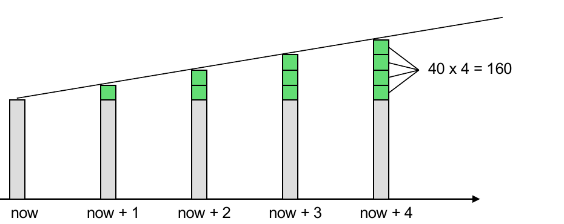
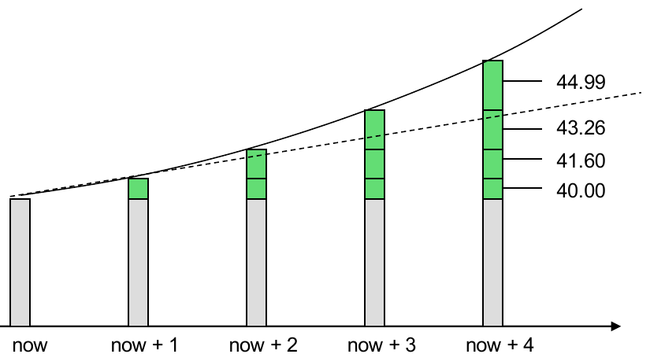
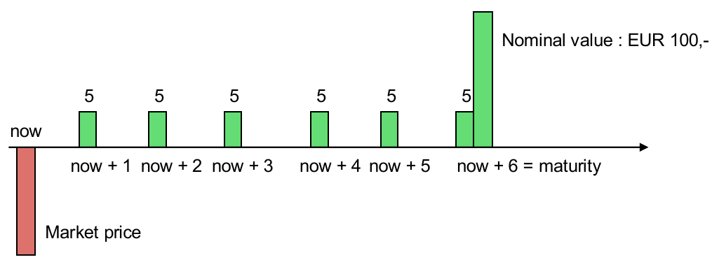
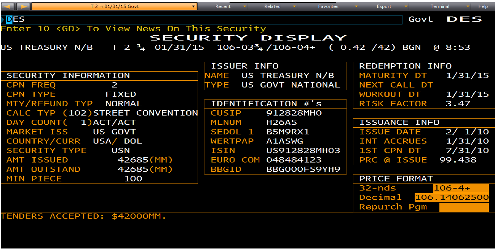
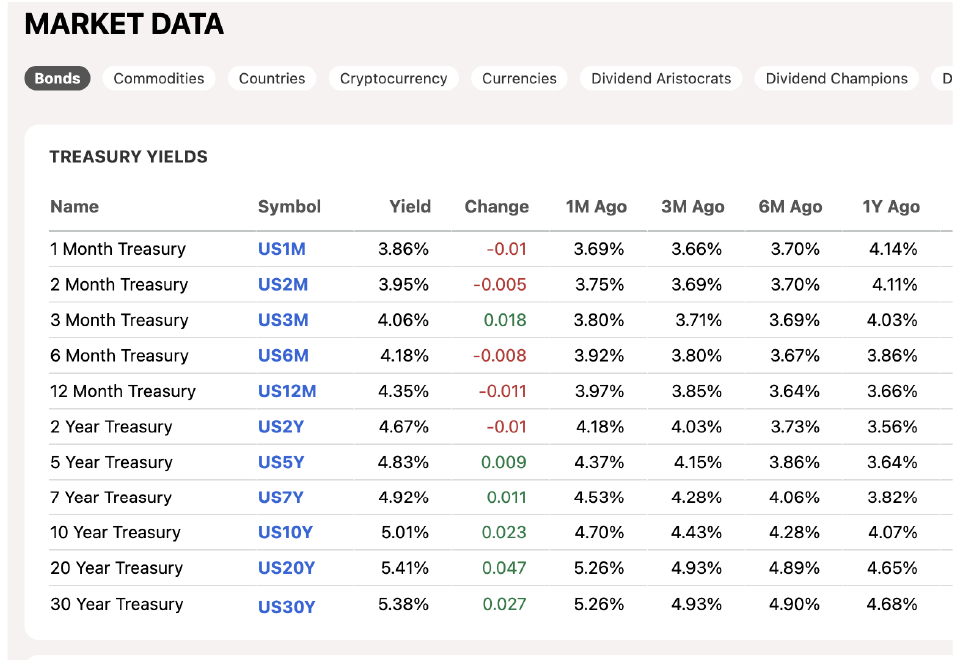
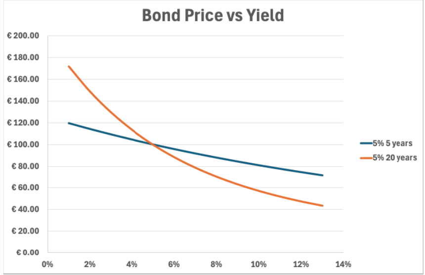

# Principles of Asset Trading — Lecture 2

**Topics:** recap → simple, compound and continuous interest → nominal vs effective return → bond pricing → yield to maturity → US bonds → duration and volatility → convexity

---

## Summary

Interest can be **simple** (always paid on the original amount) or **compound** ("interest on interest"). When a bank pays a _nominal_ rate several times a year, the **effective** annual return is higher than the nominal rate. Continuous compounding is the upper limit, with growth factor $e^r$. A **bond** is a cash-flow stream: coupons plus the nominal value at maturity. Its price is the PV of that stream. The **yield to maturity** is the rate that makes this PV equal to the market price, and it has to be solved numerically. Bond prices move **opposite** to yields. How strongly they move is measured by **duration**, the PV-weighted average payment time. Duration leads to **volatility** (modified duration): $\Delta P \approx -\Delta y \cdot \frac{D}{1+y} \cdot P$. The price–yield curve is curved (**convexity**), so this linear estimate is only accurate for small yield changes.

---

## 1. Recap: what is new compared to Lecture 1

- The rate-of-return idea is generalised. The **internal rate of return (IRR)** is the discount rate that makes **NPV = 0**.
- Invest iff NPV > 0, which is equivalent to IRR > opportunity cost of capital.
- The opportunity cost of capital has **nothing to do with the rate at which you can attract the money**.
- The valuation formulae ($P$, $P_{(n,\infty]}$, $P_{(0,n]}$, amortization) are repeated. See Lecture 1, §5.

---

## 2. Interest conventions

### 2.1 Simple interest

**Intuition:** every period you earn interest on the _original_ amount only, so the balance grows linearly.

$$A_n = (1 + n \cdot r) \cdot A_0 = A_{n-1} + r \cdot A_0$$

_Example:_ €1,000 at 4% earns €40 every period. After 4 periods the interest is $4 \cdot 40 = €160$, so the balance is €1,160.



### 2.2 Compound interest

**Intuition:** interest is added to the balance and earns interest itself. Growth is exponential.

$$A_n = A_0 \cdot (1+r)^n = (1+r) \cdot A_{n-1}$$

_Example:_ €1,000 at 4%, interest earned each year:

| Year         | 1     | 2     | 3     | 4     | Total  |
| ------------ | ----- | ----- | ----- | ----- | ------ |
| Interest (€) | 40.00 | 41.60 | 43.26 | 44.99 | 169.86 |

After 4 years the balance is €1,169.86, compared with €1,160 under simple interest.



### 2.3 Nominal vs effective return

Banks usually pay interest more than once a year. A **nominal** annual rate $r$ paid $m$ times a year means you receive $r/m$ per sub-period.

$$r_{\text{eff}} = \left(1 + \frac{r}{m}\right)^m - 1$$

The **effective return** is the rate that, paid once a year, gives the same final amount.

_Example:_ a 5% nominal rate paid quarterly means 1.25% per quarter. Balance at the start of each quarter:

| Quarter start | 1      | 2      | 3      | 4      | 5 (= after 1 year) |
| ------------- | ------ | ------ | ------ | ------ | ------------------ |
| Balance (€)   | 100.00 | 101.25 | 102.52 | 103.80 | **105.09**         |

$$r_{\text{eff}} = 1.0125^4 - 1 = 5.09\%$$

### 2.4 Continuous compounding

Keep increasing the payment frequency $m$. The growth factor converges:

$$\lim_{m \to \infty} \left(1 + \frac{r}{m}\right)^m = e^r \qquad A_t = A_0 \cdot e^{r \cdot t} \qquad r_{\text{eff}} = e^r - 1$$

_Example:_ 12% nominal on €1,000 after one year.

| Frequency  | Rate per period | Final amount | Effective |
| ---------- | --------------- | ------------ | --------- |
| Yearly     | 12%             | €1,120.00    | 12.00%    |
| Quarterly  | 3%              | €1,125.51    | 12.55%    |
| Monthly    | 1%              | €1,126.83    | 12.68%    |
| Continuous | —               | €1,127.50    | 12.75%    |

> **Exam trap:** "5% per year" is incomplete without the payment frequency. Always convert to the rate **per payment period** (nominal / m) and use $n$ in those same periods, as in the Lecture 1 mortgage.

---

## 3. Bonds

### 3.1 Cash-flow stream

You buy a **5% Bund** (a German government bond, annual coupon) with 6 years to maturity and €100 nominal value:

| t         | 0      | 1   | 2   | 3   | 4   | 5   | 6       |
| --------- | ------ | --- | --- | --- | --- | --- | ------- |
| Cash flow | −price | 5   | 5   | 5   | 5   | 5   | 5 + 100 |



### 3.2 Price = PV of the cash flows

With coupon $C$, nominal $N$, maturity $T$ and discount rate $r$:

$$P = \sum_{k=1}^{T} \frac{C}{(1+r)^k} + \frac{N}{(1+r)^T} = \underbrace{\frac{C}{r}\left(1 - \frac{1}{(1+r)^T}\right)}_{\text{annuity } P_{(0,T]}} + \frac{N}{(1+r)^T}$$

The coupons are just an annuity from Lecture 1, and the nominal is a single discounted cash flow.

**Worked example:** the 5% Bund, with 4% as the return on an equivalent investment.

$$PV_{\text{coupons}} = 5 \cdot \left[\frac{1}{0.04} - \frac{1}{0.04 \cdot 1.04^6}\right] = 26.21$$

$$PV_{\text{nominal}} = \frac{100}{1.04^6} = 79.03$$

$$P = 26.21 + 79.03 = €105.24$$

**Par / premium / discount rule:**

- Coupon > market rate: price > 100 (**premium**)
- Coupon = market rate: price = 100 (**par**)
- Coupon < market rate: price < 100 (**discount**)

### 3.3 Yield to maturity (YTM)

This is the reverse question: the market price is known, so what return does the investor demand? The **YTM** is the single rate $y$ that solves

$$P_{\text{market}} = \sum_{k=1}^{T-1} \frac{C}{(1+y)^k} + \frac{C + N}{(1+y)^T}$$

- It is the IRR of buying the bond.
- In general there is **no closed form**, so it must be solved **numerically**, for example by bisection or Newton's method.

_Example:_ the 5% Bund trades at 102. The numerical solution is $y = 4.61\%$ (see the Python check).

### 3.4 US bonds vs European bonds

|             | European govt bonds (e.g. Bund) | US Treasuries                                               |
| ----------- | ------------------------------- | ----------------------------------------------------------- |
| Coupon      | once a year                     | **twice a year** (semi-annual)                              |
| Price quote | decimal                         | in **32nds**: 106-04+ = $106 + \frac{4.5}{32} = 106.140625$ |

**US maturity classes:**

- **Bills:** up to 1 year
- **Notes:** 1–10 years
- **Bonds:** more than 10 years (20 and 30 years)

⚠️ The lecture's table labels "Bonds [1,10]" and "Notes [10,..]", which is **swapped**. Notes are 1–10 years; Bonds are longer than 10 years.

**The Bloomberg screen example (T 2¼ 01/31/15):**



- Coupon 2.25% per year, paid as 1.125% every half-year (CPN FREQ = 2, FIXED).
- Maturity 31 Jan 2015.
- Day count ACT/ACT: accrued interest uses actual days.
- Price 106-04+ in 32nds, which is 106.140625 in decimal.

**US pricing** discounts each semi-annual coupon $C/2$ at $y/2$ per half-year, over $2T$ periods:

$$P = \sum_{k=1}^{2T} \frac{C/2}{(1+y/2)^k} + \frac{N}{(1+y/2)^{2T}}$$

**The WSJ yield table:** yields rise with maturity, from about 3.9% at 1 month to about 5.4% at 20–30 years. That is an upward-sloping **yield curve** **[beyond slides]**.



---

## 4. Interest-rate risk: duration and volatility

### 4.1 Price reacts opposite to the yield

A higher yield means you discount harder, so the PV falls. Three bonds at 5%, repriced at ±0.5%:

| Yield                      | 3 yr 10%   | 3 yr 4%    | 5 yr 10%   |
| -------------------------- | ---------- | ---------- | ---------- |
| 4.5%                       | 115.12     | 98.63      | 124.14     |
| 5.0%                       | 113.62     | 97.28      | 121.65     |
| 5.5%                       | 112.14     | 95.95      | 119.22     |
| Price change (4.5% → 5.5%) | −2.98      | −2.68      | −4.92      |
| **% change = volatility**  | **−2.62%** | **−2.75%** | **−4.04%** |

**Intuition:** cash flows that are **far away** react more strongly to the discount rate, because they are discounted more times. So:

- A **longer** maturity gives higher sensitivity.
- A **lower coupon** puts relatively more weight on the final payment, which also gives higher sensitivity.

### 4.2 Duration

Duration is the **PV-weighted average payment time**:

$$D = \frac{PV(t_1) \cdot t_1 + PV(t_2) \cdot t_2 + \dots + PV(t_n) \cdot t_n}{PV}$$

- **Zero-coupon bond:** $D = T$ (there is only one payment).
- **Bond with coupons:** $0 < D < T$ (the coupons pull the average forward).

**Worked example:** the 3 yr 10% bond at 5%.

| t     | Cash flow | Discount factor | PV         | PV · t     |
| ----- | --------- | --------------- | ---------- | ---------- |
| 1     | 10        | 0.9524          | 9.52       | 9.52       |
| 2     | 10        | 0.9070          | 9.07       | 18.14      |
| 3     | 110       | 0.8638          | 95.02      | 285.07     |
| **Σ** |           |                 | **113.62** | **312.73** |

$$D = \frac{312.73}{113.62} = 2.75 \text{ years}$$

The other two bonds come out at 3 yr 4%: D = 2.88, and 5 yr 10%: D = 4.25.

### 4.3 Volatility (modified duration)

**Volatility** is the percentage price change when the yield changes by 1%. For all three bonds, $D / \text{volatility} = -1.05 = -(1+y)$. That gives:

$$\text{volatility} = -\frac{D}{1+y} \qquad\qquad \Delta P \approx -\Delta y \cdot \frac{D}{1+y} \cdot P$$

Check for the 3 yr 10% bond: $-2.75 / 1.05 = -2.62\%$, matching the table.

**Worked example:** the 5% Bund at 4% has $P = 105.24$ and $D = 5.35$, so

$$\text{volatility} = -\frac{5.35}{1.04} = -5.14\%$$

- If the yield falls to 3.8% ($\Delta y = -0.002$):

$$\Delta P \approx -(-0.002) \cdot 5.14 \cdot 105.24 = +1.08$$

- The exact new price is 106.33, i.e. a change of **+1.09**.
- The gap of 0.01 is **convexity** (§5).

> **Exam traps**
>
> - $\Delta y$ enters as a decimal: 0.2% = 0.002, and 1% = 0.01.
> - The formula is a **first-order approximation**. It is good for small $\Delta y$ and gets worse for large moves.
> - Sign convention: the lecture includes the minus sign in "volatility". Brealey & Myers quote modified duration as the positive number $D/(1+y)$.
> - For US bonds, use the semi-annual yield: $D/(1 + y/2)$ **[beyond slides]**.

---

## 5. Convexity

The price–yield relation is a **curve**, not a straight line. It is convex, meaning it bends upward.



- **Consequence:** for the same size of yield move, the price **gain** when yields fall is larger than the price **loss** when yields rise.
  - _Example:_ a 5% 20-year bond priced at 100 at a 5% yield. At 4% its price is +13.59; at 6% it is −11.47.
- **Longer maturity gives more duration and more convexity.** In the chart, the 20-year bond's curve is much steeper and more curved than the 5-year bond's. At 1%, the prices are 172 vs 119.
- ⚠️ The lecture says _"a yield change has more effect for high yields than for low yields"_. This is **backwards**.
  - The curve is **steepest at low yields**, so the same $\Delta y$ moves the price more when yields are low.
  - The formula shows it too: $D/(1+y)$ is larger when $y$ is small, and $D$ itself also rises as $y$ falls.
- **"Bonds with equal duration should react similarly…"** Only for **small** yield changes. For large moves, the bond with more convexity performs better, in both directions.

---

## Questions from the lecture

**Q1. What yields more: 12% once a year, 3% per quarter, or 1% per month (on €1,000)?**
**Answer:** Monthly: €1,126.83, vs €1,125.51 quarterly and €1,120 yearly.
_Why:_ more frequent payments mean interest starts earning interest sooner. The nominal rate is the same, but the effective rate rises with frequency.

**Q2. Does the limit $\lim_{n\to\infty}(1 + r/n)^n$ exist?**
**Answer:** Yes. It equals $e^r$, so at 12% the maximum is $1000 \cdot e^{0.12} = €1{,}127.50$.
_Why:_ take logs: $n \cdot \ln(1 + r/n)$. Since $\ln(1+x) \approx x$ for small $x$, this equals $n \cdot r/n = r$. So the growth factor converges to $e^r$. More frequent compounding gives more, but **bounded**.

**Q3. What is the effective interest if the bank (5% nominal) pays once per second?**
**Answer:** About 5.127%.
_Why:_ one year has $365 \cdot 24 \cdot 3600$ ≈ 31.5 million seconds, which is practically continuous: $e^{0.05} - 1 = 5.127\%$. Compare quarterly (5.09%): going from quarterly to every second adds only about 0.04 percentage points.

**Q4. What does the cash-flow stream of a 6-year 5% Bund (€100 nominal) look like?**
**Answer:** −price now, then +5 in years 1–5, and +105 in year 6.
_Why:_ the annual coupon is 5% · 100 = 5, and the nominal is repaid at maturity together with the last coupon.

**Q5. Do you want to pay more or less than €100 for this bond?**
**Answer:** It depends on the return of an equivalent investment. At 4% you pay **more**: €105.24.
_Why:_ the bond pays 5 per year while the market only offers 4. Those extra coupons are worth something, so the price rises above 100 until the bond's return drops to 4%. At a 5% market rate you'd pay exactly 100; above 5%, less.

**Q6. The equivalent return drops from 4% to 3.8%. Will the bond price be higher or lower?**
**Answer:** Higher: €106.33 (+1.09).
_Why:_ a lower discount rate gives a higher PV for every cash flow. The duration estimate gives +1.08 (§4.3).

**Q7. At a market price of 102, is $y$ bigger than 4%? Bigger than 5%?**
**Answer:** Bigger than 4%, smaller than 5%. The numerical solution is $y = 4.61\%$.
_Why:_ at 4% the price would be 105.24 > 102, so $y$ must be higher (a lower price means a higher yield). At 5% the price is exactly 100 < 102, so $y$ must be lower.

**Q8. If the interest rate changes, in what direction does the bond price change?**
**Answer:** The opposite direction: rates up, price down.
_Why:_ the price is a sum of cash flows divided by $(1+y)^t$, and each term decreases as $y$ increases.

**Q9. Which bond has the highest volatility?**
**Answer:** The 5 yr 10% bond, at −4.04%.
_Why:_ its cash flows are furthest in the future (D = 4.25). Among the two 3-year bonds, the 4% coupon (−2.75%) is more volatile than the 10% coupon (−2.62%). A lower coupon puts relatively more PV at maturity, which gives a higher duration.

**Q10. What do you observe in the duration vs volatility table?**
**Answer:** For all three bonds, duration / volatility = −1.05 = −(1 + y).
_Why:_ this is not a coincidence. It gives the general rule volatility = −D/(1+y). So duration alone (plus the yield) tells you the interest-rate sensitivity.

**Q11. Deduce $\Delta P = -\Delta y \cdot \frac{D}{1+y} \cdot P$ (homework assignment).**
**Hint only**, since this is an assignment:

1. Write $P(y) = \sum_t CF_t \cdot (1+y)^{-t}$.
2. Differentiate with respect to $y$.
3. Pull a factor $\frac{1}{1+y}$ out of the sum.
4. Compare what remains with the numerator of $D$.
5. Finish with $\Delta P \approx \frac{dP}{dy} \cdot \Delta y$.

Send me your derivation and I'll check it.

**Q12. "Bonds with equal duration should react similarly to changes in yields…" Is that the full story?**
**Answer:** Only for **small** yield changes.
_Why:_ duration is the slope (first-order effect). For larger moves the curvature (convexity) matters, and two bonds with equal duration but different convexity will diverge. The one with more convexity gains more and loses less.

---

## Key-formulas box

$$\text{Simple: } A_n = (1 + n \cdot r) \cdot A_0 \qquad \text{Compound: } A_n = A_0 \cdot (1+r)^n \qquad \text{Continuous: } A_t = A_0 \cdot e^{r \cdot t}$$

$$r_{\text{eff}} = \left(1 + \frac{r}{m}\right)^m - 1 \qquad r_{\text{eff, cont}} = e^r - 1$$

$$P = \frac{C}{y}\left(1 - \frac{1}{(1+y)^T}\right) + \frac{N}{(1+y)^T} \qquad \text{US: } y \to y/2,\ C \to C/2,\ T \to 2T$$

$$D = \frac{\sum_t PV(t) \cdot t}{PV} \qquad \text{volatility} = -\frac{D}{1+y} \qquad \Delta P \approx -\Delta y \cdot \frac{D}{1+y} \cdot P$$

## Python check

```python
from scipy.optimize import brentq

def price(C, T, y, N=100):
    return sum(C/(1+y)**k for k in range(1, T+1)) + N/(1+y)**T

def duration(C, T, y, N=100):
    pv = [(C + (N if k == T else 0))/(1+y)**k for k in range(1, T+1)]
    return sum(k*v for k, v in enumerate(pv, 1)) / sum(pv)

print(round(price(5, 6, 0.04), 2))                                   # 105.24
print(round(price(5, 6, 0.038), 2))                                  # 106.33
print(round(brentq(lambda y: price(5, 6, y) - 102, 0.001, 0.2), 4))  # 0.0461  (YTM)
print(round(duration(10, 3, 0.05), 2))                               # 2.75
```

---

## Links to earlier lectures

- **Intro:** the bond definition (coupon, nominal, credit spread) is now **priced**. Semi-annual US coupons are a market convention, like the Euronext trading hours.
- **Lecture 1:** bond price = annuity $P_{(0,T]}$ + a discounted nominal. The YTM is the IRR of the bond. The monthly-mortgage rate (5.4%/12) is exactly the nominal-rate convention from §2.3.
- **Lecture 1:** risk-free cash flows are discounted at the government rate. A Bund's yield is that benchmark.

## Open questions

1. Is the lecture's convexity sentence ("more effect for high yields") a typo, or does it mean something else, such as absolute vs relative changes?
2. How do you compute accrued interest when you buy a bond between coupon dates (dirty vs clean price, ACT/ACT)? **[beyond slides]**
3. How does duration change as time passes and as yields change?
4. Can a portfolio be protected against rate moves by matching duration (immunisation)? This is what pension funds do with long liabilities. **[beyond slides]**
