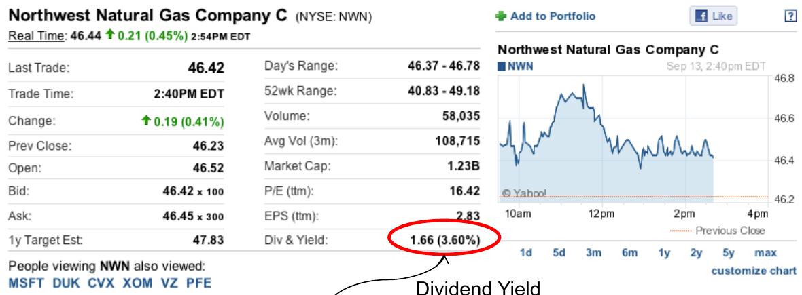
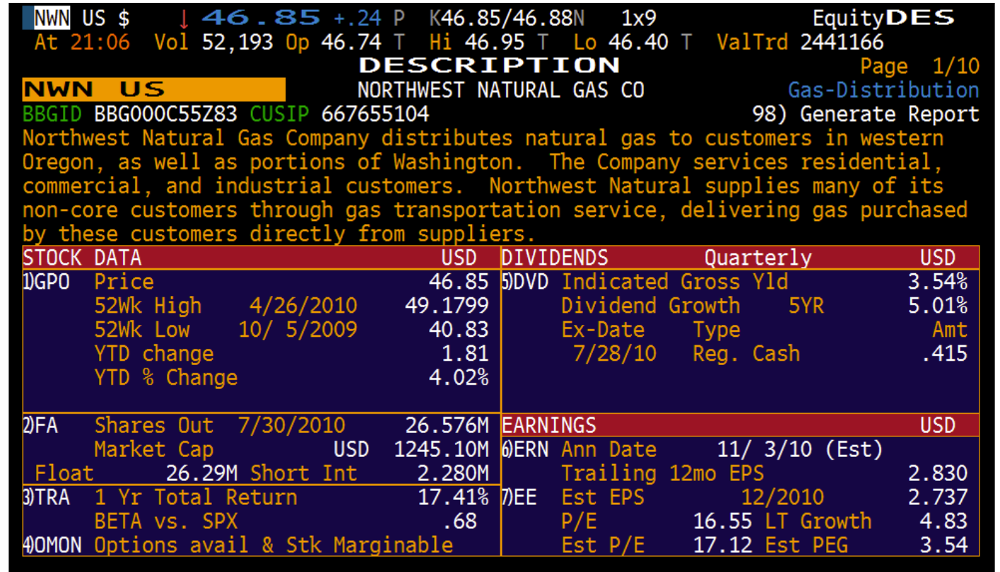
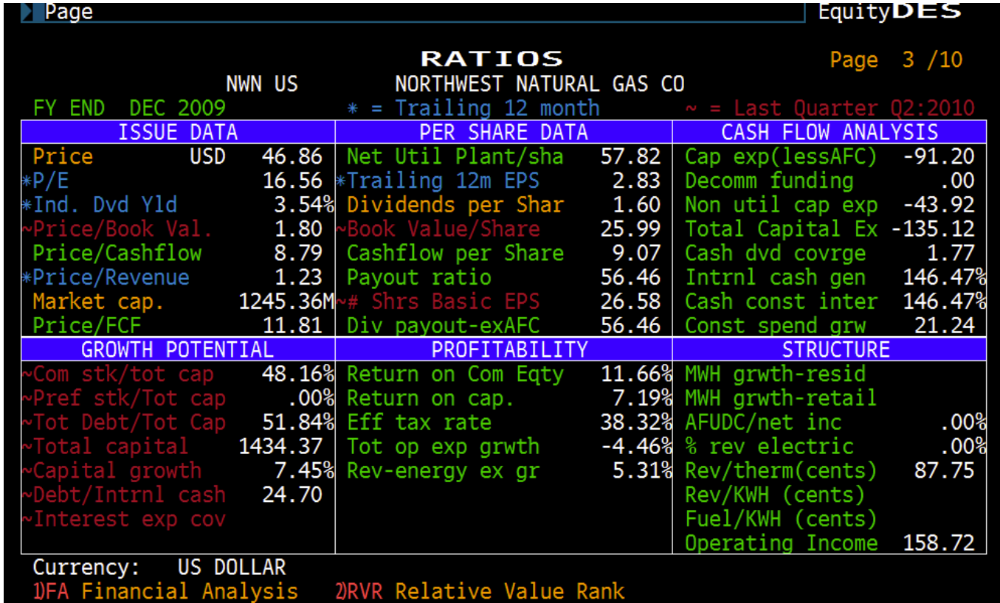
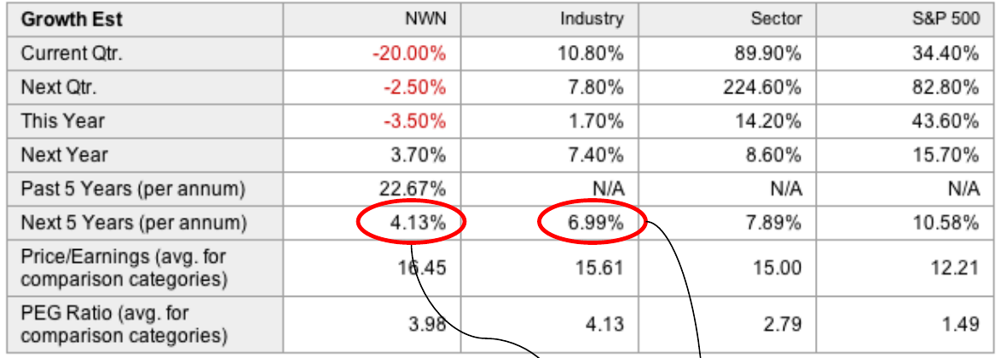
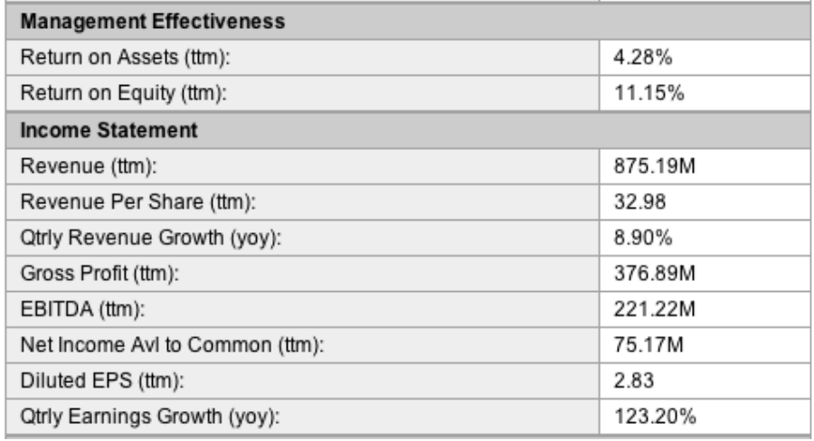
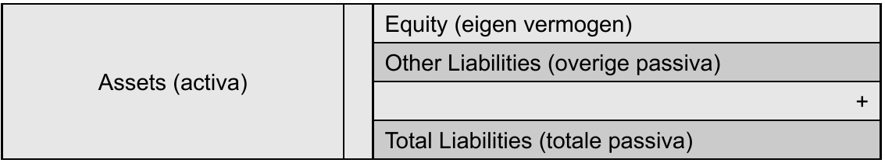
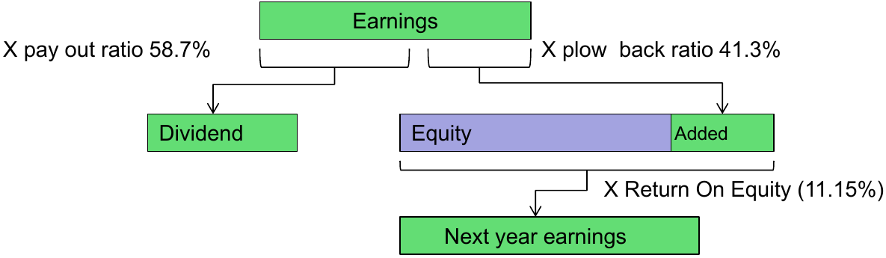
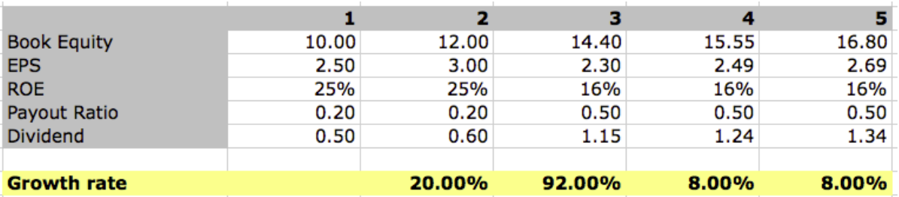
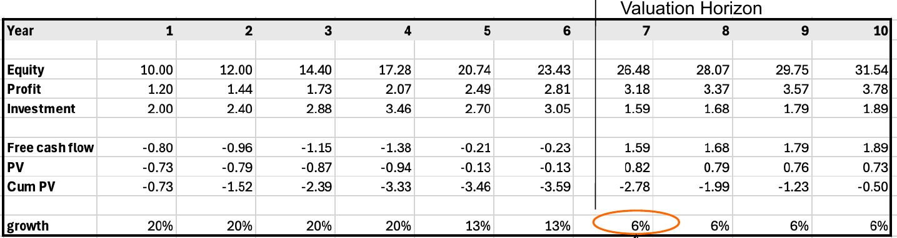
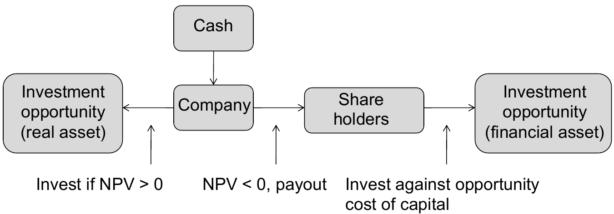

# Principles of Asset Trading — Lecture 4

**Topics:** recap → cost of equity in practice (Northwest Natural Gas) → payout, plowback and sustainable growth → two-stage growth (Growth-Tech) → PVGO → discounted free cash flow and horizon value → the NPV rule and payout

---

## Summary

To use $r = DIV_1/P_0 + g$, you need the growth rate $g$. You can take it from **analysts' forecasts**, or estimate it as **sustainable growth** $g = \text{plowback} \cdot ROE$. For Northwest Natural Gas the two routes give a cost of equity of about **7.7%** and **8.2%**. These estimates are noisy and assume growth forever, so the cost of equity should come from a **group of firms with the same risk**, not one stock. High growth (e.g. 20%) can't last forever, so you use a **two-stage model**: discount the explicit dividends of the high-growth years, then add a constant-growth **horizon value**. For whole companies, or firms that pay little in dividends, you discount **free cash flow** (FCF) instead: the cash left after all investment needed for continuation and growth. Reinvesting only creates value when the return on the new investment exceeds the cost of capital. Otherwise the cash should go back to shareholders.

---

## 1. Recap

- **Spot rates and forward rates:** $f_{1,2} = \frac{(1+s_2)^2}{1+s_1} - 1$ (Lecture 3, §3).
- **Equity** entitles you to the future dividend cash flows:

$$P_0 = \frac{D}{r} \qquad P_0 = \frac{DIV_1}{r-g} \qquad r = \frac{DIV_1}{P_0} + g$$

---

## 2. Cost of equity in practice: Northwest Natural Gas

### 2.1 The data

NWN is a gas-distribution utility: a stable business, so a good test case for constant growth.



Bloomberg gives slightly different figures for the same firm:

- dividend yield 3.54%
- 5-year dividend growth 5.01%
- "LT Growth" 4.83%
- ROE 11.66%
- payout 56.46%
- book value per share 25.99





### 2.2 Route 1: dividend yield + analysts' growth

- Dividend yield from Yahoo: **3.6%**.
- The analyst consensus for growth over the **next 5 years** is **4.13%**.

$$r = 3.6\% + 4.13\% = 7.73\%$$



- The lecture calls the 6.99% "the sector", but in the table it is the **industry** figure. The sector column shows 7.89%.
- NWN's past 5-year growth was 22.67%, far above the forecast. Past growth is a poor guide to the future.

### 2.3 Route 2: sustainable growth from EPS and ROE

Data: EPS = 2.83, DIV = 1.66, ROE = 11.15%.



**Balance sheet logic:**



- **ROE** = earnings as a percentage of the (book) **equity**.
- Each year, earnings are split in two:
  - **paid out** as dividends: **payout ratio** = DIV / EPS
  - **added to equity**: **plowback ratio** = 1 − payout ratio
- The added equity also earns the ROE. That is where the growth comes from.

$$\text{Payout} = \frac{1.66}{2.83} = 58.7\% \qquad \text{Plowback} = 1 - 0.587 = 41.3\%$$

$$g = \text{plowback} \cdot ROE = 0.413 \cdot 0.1115 = 4.60\%$$

$$r = 3.6\% + 4.6\% = 8.2\%$$

⚠️ The lecture compares this with "7.76% from the previous calculation". Route 1 actually gave **7.73%**.



**Intuition:** if 41.3% of the earnings stays in the firm and every euro of equity earns 11.15%, then equity, and with it earnings and dividends, grows by $0.413 \cdot 11.15\% = 4.6\%$ a year.

### 2.4 Caveats

- **Use a sector average.** For mature, stable sectors, take the average over companies in the same sector. The cost of equity belongs to a **risk profile**, not to one stock.
- **Analyst growth is positively biased.** A cost of equity based on the consensus is therefore an **upper bound**.
- **Constant growth until infinity.** All these calculations assume it. Even if that's true, the estimate of $g$ is very **sensitive to noise**, and every error in $g$ goes one-to-one into $r$.

---

## 3. Short- and long-term growth

### 3.1 Growth-Tech: when constant growth breaks down

Growth-Tech Inc. has $DIV_1 = 0.50$, $P_0 = 50$, plowback 80% and ROE 25%.

$$g = 0.80 \cdot 0.25 = 20\% \quad\Rightarrow\quad \text{naive Gordon: } r = \frac{0.50}{50} + 0.20 = 21\%$$

- A **20% growth rate is not sustainable** forever, so 21% is not a credible cost of equity.
- The book's example: US railroad companies grew 15–16% a year in 2005–2006. It is not realistic to assume such growth up to infinity.

### 3.2 Two-stage model

In general the ROE declines gradually, so the company plows back less.

**Assumption:** in year 3 the ROE suddenly drops to **16%** and plowback drops from 80% to **50%**. The long-term growth rate is then:

$$g_{\text{long}} = 0.50 \cdot 0.16 = 8\%$$

**The numbers** (EPS = ROE · book equity at the start of the year; equity grows by the retained earnings):



| Year | Book equity | ROE | EPS  | Payout | DIV  | DIV growth |
| ---- | ----------- | --- | ---- | ------ | ---- | ---------- |
| 1    | 10.00       | 25% | 2.50 | 20%    | 0.50 |            |
| 2    | 12.00       | 25% | 3.00 | 20%    | 0.60 | 20%        |
| 3    | 14.40       | 16% | 2.30 | 50%    | 1.15 | 92%        |
| 4    | 15.55       | 16% | 2.49 | 50%    | 1.24 | 8%         |
| 5    | 16.80       | 16% | 2.69 | 50%    | 1.34 | 8%         |

_Check:_ the year-4 equity is $14.40 + 2.30 \cdot 0.50 = 15.55$, so equity now grows by $0.50 \cdot 16\% = 8\%$.

**Two-stage price:** dividends are only stable from year 3 on, so

$$P_0 = \frac{DIV_1}{1+r} + \frac{DIV_2}{(1+r)^2} + \frac{DIV_3 + P_3}{(1+r)^3} \qquad P_3 = \frac{DIV_4}{r - 0.08}$$

$$P_0 = \frac{0.50}{1+r} + \frac{0.60}{(1+r)^2} + \frac{1.15}{(1+r)^3} + \frac{1.24}{(1+r)^3 \cdot (r - 0.08)} = 50$$

Solving numerically gives **$r \approx 9.9\%$**, with $P_3 = 1.24 / 0.019 \approx 64$. The lecture leaves $r$ unsolved; 9.9% is also Brealey & Myers' answer. That is far more realistic than the naive 21%.

> **Exam traps**
>
> - The horizon price $P_3 = DIV_4/(r-g)$ is a value **at year 3**. Discount it with $(1+r)^3$, not $(1+r)^4$.
> - In year 3 the dividend jumps by 92% (0.60 → 1.15) even though **EPS falls** (3.00 → 2.30). The payout rises from 20% to 50%. Don't use that 92% as a growth rate.
> - $r$ can only be solved numerically, just like the YTM.

### 3.3 PVGO: when does growth create value? [beyond slides, B&M]

Split the price into "no growth" plus the value of growth opportunities:

$$P_0 = \frac{EPS_1}{r} + PVGO$$

$EPS_1/r$ is the value if the firm paid out **all** earnings (no growth).

|         | Effect of plowing back                         | PVGO |
| ------- | ---------------------------------------------- | ---- |
| ROE > r | new investments have NPV > 0                   | > 0  |
| ROE = r | NPV = 0: the firm grows, but the price doesn't | = 0  |
| ROE < r | value destroyed                                | < 0  |

_Growth-Tech at $r = 9.9\%$:_

- $EPS_1/r = 2.50 / 0.099 = 25.2$
- $PVGO = 50 - 25.2 = 24.8$

About half the price is the value of future growth opportunities. Those come from the early years, when ROE = 25% is far above $r$.

**Link to §5:** this is the NPV rule applied to retained earnings.

---

## 4. Discounted cash flow (DCF)

### 4.1 Free cash flow

**Free cash flow (FCF)** is the cash flow left after the company has made all the investments needed for continuation and growth:

$$FCF = \text{earnings} - \text{net investment}$$

This values the business itself, independent of payout policy.

### 4.2 Worked example

- The company grows its assets by 20% a year at first, then slows to 13%, and from year 7 on grows at 6% forever.
- Profitability: ROE = earnings / assets = **12%**.
- Market capitalisation rate (cost of capital) $r$ = **10%**.



| Year            | 1     | 2     | 3     | 4     | 5     | 6     | 7        | 8     | 9     | 10    |
| --------------- | ----- | ----- | ----- | ----- | ----- | ----- | -------- | ----- | ----- | ----- |
| Equity (assets) | 10.00 | 12.00 | 14.40 | 17.28 | 20.74 | 23.43 | 26.48    | 28.07 | 29.75 | 31.54 |
| Earnings (12%)  | 1.20  | 1.44  | 1.73  | 2.07  | 2.49  | 2.81  | 3.18     | 3.37  | 3.57  | 3.78  |
| Net investment  | 2.00  | 2.40  | 2.88  | 3.46  | 2.70  | 3.05  | 1.59     | 1.68  | 1.79  | 1.89  |
| **FCF**         | −0.80 | −0.96 | −1.15 | −1.38 | −0.21 | −0.23 | **1.59** | 1.68  | 1.79  | 1.89  |
| Asset growth    | 20%   | 20%   | 20%   | 20%   | 13%   | 13%   | 6%       | 6%    | 6%    | 6%    |

- Net investment = growth of the equity. The slide's table also shows PV and cumulative PV; the cumulative PV of years 1–6 is −3.59.
- FCF is **negative** while the company grows fast. It invests more than it earns, which is not a bad sign.

### 4.3 Valuation horizon

The **valuation horizon** $H = 6$ is chosen as exactly the moment after which the company enters its **stable growth** phase. Beyond $H$ you no longer analyse individual cash flows; you value the rest with the constant-growth formula:

$$PV = \underbrace{\sum_{t=1}^{H} \frac{FCF_t}{(1+r)^t}}_{PV(\text{FCF})} + \underbrace{\frac{1}{(1+r)^H} \cdot \frac{FCF_{H+1}}{r - g}}_{PV(\text{horizon value})}$$

**Step by step:**

1. $PV(FCF_{1..6}) = \frac{-0.80}{1.1} + \frac{-0.96}{1.1^2} + \dots + \frac{-0.23}{1.1^6} = -3.6$
2. Horizon value at year 6: $PV_H = \frac{1.59}{0.10 - 0.06} = 39.7$
3. Discount it to today: $39.7 / 1.1^6 = 22.4$
4. Total: $PV = -3.6 + 22.4 = 18.8$

⚠️ The lecture says the FCF after the horizon "starts with 1.59 and **grows with 10%**". The growth rate is **6%**. 10% is the discount rate, and with $g = r$ the formula would blow up. The lecture's formula also writes $\frac{1}{1.1}$ where it means $\frac{1}{1.1^6}$. The 22.4 is computed with $1.1^6$.

> **Exam traps**
>
> - $PV_H$ uses $FCF_{H+1}$, the first cash flow _after_ the horizon, and is a value **at time H**.
> - Pick $H$ where growth really has stabilised. With a horizon that's too early, the horizon value assumes a growth rate that hasn't settled yet.
> - Most of the value (22.4 of 18.8, i.e. more than 100%) sits in the horizon value, so the result is very sensitive to $g$ and $r$.

### 4.4 Other ways to estimate the horizon value

Instead of the constant-growth formula, you can use **market multiples** of comparable firms, e.g. the price/earnings ratio or price-to-book. **Be careful:** multiples only work if the comparables really are similar (risk, growth, profitability), and they import whatever mispricing the market currently has.

---

## 5. NPV rule, IRR and payout

NPV > 0 is equivalent to IRR > opportunity cost of capital. Applied to a company with cash:



- The company should only keep and invest cash in projects that beat what shareholders can earn themselves at the **same risk**.
- Otherwise, paying it out is better.
- This is the same message as PVGO: plowback only adds value if ROE > r.

---

## Questions from the lecture

**Q1. How do you determine the growth rate g?**
**Answer:** Two ways in the lecture:

1. The **analyst consensus**: 4.13% gives $r = 7.73\%$.
2. **Sustainable growth** = plowback · ROE = 0.413 · 11.15% = 4.6%, which gives $r = 8.2\%$.

_Why:_ $g$ can't be observed. Analysts forecast it directly, while the sustainable-growth route derives it from how much the firm reinvests and what that reinvestment earns. Historical dividend growth is a third option **[beyond slides]**.

**Q2. Is $r = 7.73\%$ (analyst growth 4.13%) consistent with the growth rate of 6.99% for the sector?**

**Answer:** Not really. Analysts expect the **industry** (6.99%; the sector even 7.89%) to grow much faster than NWN (4.13%). If NWN had the same risk and the same growth as its peers, adding the peer growth to NWN's yield would give a cost of equity near 3.6% + 6.99% ≈ 10.6%, far from 7.73%.

_Why:_ the cost of equity belongs to a **risk profile**, so similar utilities should have a similar $r$. Different growth estimates should come with different dividend yields. The gap shows how noisy single-stock estimates are. NWN's own numbers already range from 4.13% (consensus) through 4.6% (plowback · ROE) to 4.83% / 5.01% (Bloomberg), i.e. $r \approx 7.7\%$–$8.6\%$. Analyst forecasts are also 5-year figures, not "forever", and positively biased. Hence the lecture's conclusion: average over comparable companies and treat consensus-based results as an upper bound.

**Q3. Why is the FCF method especially valuable to big investors?**
**Answer:** A big investor (private equity, or a company buying another) can take **control** of the firm and decide the payout policy itself. So what matters is all the cash the business generates, not the dividends the current management chooses to pay.
_Why:_ dividends are a policy choice. FCF measures the cash available to the owners after all necessary investment, which is the value of the business itself. It also works for companies that pay no dividends.

**Q4. Is the constant-growth formula the only way to determine the horizon value?**
**Answer:** No. You can also use **market multiples** of comparable companies, such as the P/E ratio or price-to-book.
_Why:_ multiples are quick and market-based, but risky. They assume the comparables have the same growth, risk and profitability, and they import any current over- or undervaluation. Hence the lecture's warning: "be careful with this method!"

---

## Key-formulas box

$$\text{Payout} = \frac{DIV}{EPS} \qquad \text{Plowback} = 1 - \frac{DIV}{EPS} \qquad g = \text{plowback} \cdot ROE \qquad ROE = \frac{EPS}{\text{book equity per share}}$$

$$r = \frac{DIV_1}{P_0} + g \qquad P_0 = \sum_{t=1}^{H} \frac{DIV_t}{(1+r)^t} + \frac{1}{(1+r)^H} \cdot \frac{DIV_{H+1}}{r - g} \qquad P_0 = \frac{EPS_1}{r} + PVGO$$

$$FCF = \text{earnings} - \text{net investment} \qquad PV = \sum_{t=1}^{H} \frac{FCF_t}{(1+r)^t} + \frac{1}{(1+r)^H} \cdot \frac{FCF_{H+1}}{r - g}$$

## Python check

```python
from scipy.optimize import brentq

# Growth-Tech: solve the two-stage model for r
f = lambda r: 0.5/(1+r) + 0.6/(1+r)**2 + 1.15/(1+r)**3 + 1.24/((r-0.08)*(1+r)**3) - 50
print(round(brentq(f, 0.0801, 0.5), 4))         # 0.0994

# DCF example: ROE 12%, r 10%, growth 20/20/20/20/13/13 then 6%
g = [.20, .20, .20, .20, .13, .13, .06]
assets = [10.0]
for k in range(6):
    assets.append(assets[-1] * (1 + g[k]))
fcf = [0.12*assets[k] - g[k]*assets[k] for k in range(7)]
pv_fcf = sum(fcf[k]/1.1**(k+1) for k in range(6))
pv_hv = fcf[6]/(0.10 - 0.06) / 1.1**6
print(round(pv_fcf, 1), round(pv_hv, 1), round(pv_fcf + pv_hv, 1))   # -3.6 22.4 18.8
```

---

## Links to earlier lectures

- **Lecture 3:** this lecture finishes the NWN example ("how to determine g?") and fixes the Gordon model's weak spot: growth isn't constant forever.
- **Lecture 1:** two-stage valuation = PV of explicit cash flows + a discounted perpetuity, the same building blocks as $P_{(0,n]}$ and the delayed perpetuity $P_{(n,\infty]}$. The horizon value is a delayed growing perpetuity.
- **Lecture 1:** the NPV rule (§5 here). Shareholders' opportunity cost of capital decides whether retained cash should be invested or paid out, which is the saver/spender logic again.
- **Lecture 2:** solving the two-stage model for $r$ is the same numerical problem as solving for the YTM.

## Open questions

1. Why do Yahoo and Bloomberg report different ROE (11.15% vs 11.66%) and payout (58.7% vs 56.5%) for the same firm? (Different periods and definitions: trailing 12 months vs fiscal year.)
2. How do you pick the valuation horizon when growth declines gradually instead of in steps?
3. With FCF valuation, which discount rate do you use if the firm also has debt (cost of equity vs WACC)? **[beyond slides]**
4. How do share buybacks fit into "PV of dividends"? **[beyond slides]**
